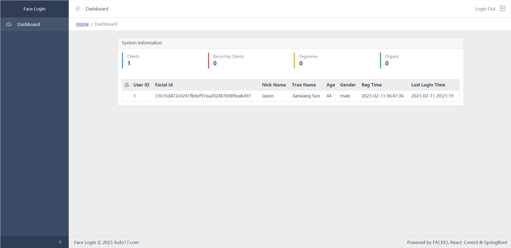

# FaceLogin

This project realizes the registration and verification of users through the face recognition technology of the third party artificial intelligence, and completes user login in combination with JWT. It does not include the use of email, SMS and other registration and verification methods.


Directory structure of source code\
|-- FaceLogin\
|   |-- FaceLoginClient [Front-end]\
|   |-- FaceLoginServer [Back-end]\
|   |-- MySql [database-sql]\
|   |-- screenshot

This project is a simple and complete WEB microservice system. The project adopts the development method of separating the front and back ends, and uses different project file paths. The front-end uses React, the back-end uses SpringBoot microservice, and the database uses MySQL. The front end integrates FaceIO in React to realize the docking of AI.





The backend SpringBoot microservice uses port 8080 by default, which can be modified according to your own situation. The file location of the front-end configuration server is "/FaceLogin/FaceLoginClient/src/tool/http-common.js", and the variable name is "serverUrl".
````
const serverUrl='http://localhost:8080';
````
## Technology Stack
Front-end: NodeJs 18.0.0, React 18.2.0, FaceIO, CoreUI 4.3.1\
Front-end development tool: WebStorm 2019\
Back-end: Java 1.8, Spring Boot, JWT, Mybatis, Maven\
Back-end development tool: IntelliJ IDEA 2019\
Database: MySQL 5.7+

I wrote an article on this project. If you are interested, you can visit the following website link\
https://betterprogramming.pub/how-to-use-faceio-to-develop-the-user-authentication-module-of-web-app-based-on-ai-603fa60921ed\
https://www.linkedin.com/pulse/how-use-faceio-develop-user-authentication-module-web-jianxiang-sun\
https://dzone.com/articles/how-to-use-faceio-to-develop-the-user-authenticati
